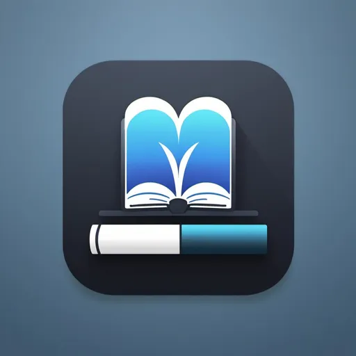

## Libra Hub

Este é o meu projeto de conclusão do curso profissional de TGPSI (Técnico de Gestão e Programação de Sistemas Informáticos) no Agrupamento de Escolas de José Relvas.

O projeto consiste numa aplicação web que permite a gestão de uma biblioteca. A aplicação permite a gestão de livros, autores, editoras, categorias, requisições e bibliotecários.

